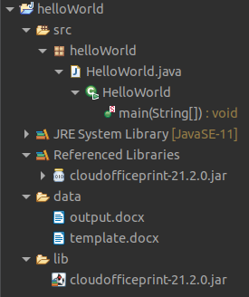

# cloudofficeprint-java
This project provides a Java interface for Cloud Office Print.

# Installation
## .jar
To install the Cloud Office Print Java package you can download the .jar file of the project and add it to the build path of your project. 
TODO: upload .jar to website
## Gradle
To use the Cloud Office Print Java package in a Gradle project, you can add it as a dependency to your `build.gradle` file. In this file, add the following line to the `dependencies`-object:
```gradle
implementation group: 'com', name: 'cloudofficeprint', version: '0.1.0'
```
TODO: update the command

# Usage
1. Create a template (docx, xlsx, pptx, HTML, md, txt, csv), for the possible tags, click [here](http://www.cloudofficeprint.com/docs/#templates).
2. Create the input data with this Java SDK
3. Send template and data to an Cloud Office Print server and save the response to a file with this Java SDK

To see the JSON-data that is sent to the Cloud Office Print server together with some information about the requests and responses, you can turn on verbose-mode by first creating a `Server`-object and then calling `.setVerbose(true)` on that object.

# Quickstart: Hello World example
## Template (docx)

<!-- TODO: change this link to Github link -->

## Setup
The data can be generated by the Java SDK. This example uses [Eclipse](https://www.eclipse.org/), but other IDEs work very similar. First, create a new Java project in Eclipse or use an existing one. After downloading our .jar file (TODO: ref to website) together with the other .jar files, you can add them to the project by creating a 'lib'-folder on the same level as the 'src'-folder and putting the .jar files inside the 'lib'-folder.

Next, you have to add those .jar files to the classpath of the project. You can do so by right-clicking the root folder of your project and clicking 'Build Path > Configure Build Path...'. Go to the tab 'Libraries', click on 'Classpath' and click on 'Add JARs...'. Navigate to your 'lib'-folder in your project and select all .jar files. Finally, click 'Apply and Close' and we're done.

Then create your main file by right-clicking the 'src'-folder of your project, clicking 'New > Class', choosing a name for the Class and clicking 'Finish'. In this example, we chose the name 'HelloWorld' as the name for our class where we want to use this Java SDK.

## Data & print job
First we add the data needed to fill in the template, which can be seen in the code below. The template and the data need to be sent to an Cloud Office Print server that merges both. This can be done by setting up the configuration for Cloud Office Print server and passing it to the print job instance, which can also be seen in the code below. You can get your API key by signing up at https://www.cloudofficeprint.com.
```java
package HelloWorld;

import java.util.Hashtable;

import com.cloudofficeprint.PrintJob;
import com.cloudofficeprint.Response;
import com.cloudofficeprint.Output.Output;
import com.cloudofficeprint.RenderElements.ElementCollection;
import com.cloudofficeprint.RenderElements.Property;
import com.cloudofficeprint.RenderElements.RenderElement;
import com.cloudofficeprint.Resources.Base64Resource;
import com.cloudofficeprint.Server.Server;

public class HelloWorld {
	public static void main(String[] args) throws Exception {
		// Main object that holds the data
		ElementCollection collection = new ElementCollection("data");

		// Create the title element and add it to the element collection
		Property title = new Property(
				"title",
				"Hello World!"
		);
		collection.addElement(title);

		// Create the text element and add it to the element collection
		Property text = new Property(
		    "text",
		    "This is an example created with the Cloud Office Print Java SDK"
		);
		collection.addElement(text);
		
		//Set-Up Cloud Office Print server
        Server copServer = new Server("https://api.cloudofficeprint.com/");
        copServer.setVerbose(true);
        copServer.setAPIKey("YOUR_API_KEY"); // Replace by your own API key
        
        // Load template
        Base64Resource base64Resource = new Base64Resource();
        base64Resource.setFileFromLocalFile("./data/template.docx");
        
        // Create the data object which uses the data collection
        Hashtable<String, RenderElement> data = new Hashtable<String, RenderElement>();
        data.put("data", collection);
		
        // Specify the output configuration and create the print job
		Output output = new Output(null, "raw", "libreoffice", null, null, null, null);
        PrintJob printJob = new PrintJob(data, copServer, output, base64Resource, null, null, null, null);

        // Execute the print job, which sends the template and data to the Cloud Office Print server and receives the server reponse
        Response response = printJob.execute();

        // Save the server response (output file) to your computer
        response.downloadLocally("./data/output");
	}
}
```

## File structure
The structure of the Eclipse Java project can be seen below.


<!-- TODO: change this link to Github link -->

## Result

<!-- TODO: change this link to Github link -->

# Other examples
Going through the other examples is also recommended as this gives you a good idea on how to use the SDK. The examples are:
- general examples: Examples.java
- multiple request merge example: MultipleRequestMergeExample.java
- order confirmation example: OrderConfirmationExample.java
- solar system example: SolarSystemExample.java
- SpaceX example: SpaceXExample.java (the most extensive example)

The examples can be found in the directory 'src/main/java/com/cloudofficeprint/Examples' of the project on [Github](https://github.com/United-Codes/apexofficeprint-java). Each example has a markdown file explaining everything about that example.

The examples can be run from the Main.java file, which can be found in the directory 'src/com/CloudOfficePrint/' of the project on [Github](https://github.com/United-Codes/apexofficeprint-java). In the Main.java file you can uncomment the examples you want to run.

To run the Main.java file in Eclipse, you can right-click inside the editor of the Main.java file, then choose 'Run As > 1 Java Application'. You have to pass your API key as an argument when running the Main.java file. To do this, right-click inside the editor of the Main.java file and select 'Run As > Run Configurations...'. Then open the tab 'Arguments' and enter your API key inside the 'Program arguments' box and click 'Run'.

To run the Main.java file in Visual Studio Code, there should be a 'Run'-button in the editor above the main()-function which you can click. Another way to run the Main.java file in Visual Studio Code is to right-click inside the editor of the Main.java file and then choose 'Run Java'. You have to pass your API key as an argument when running the Main.java file. To do this, you have to create a `launch.json` file inside the `.vscode`-folder with the following structure:
```json
{
    "configurations": [
        {
            "type": "java",
            "name": "Launch Main",
            "request": "launch",
            "mainClass": "com.cloudofficeprint.Main",
            "projectName": "cloudofficeprint-cloudofficeprint",
            "args": "dummy_api",
        }
    ]
}
```

# Documentation

The documentation for this SDK can be found inside the folder `build/docs/javadoc/` on [Github](https://github.com/United-Codes/apexofficeprint-java). If you want to generate this documentation yourself, see the [Gradle section](#generate-documentation). In Eclipse, select the root folder, click 'Project' in the top bar and click 'Generate Javadoc...'.

The full Cloud Office Print documentation can be found at the [Cloud Office Print docs](https://www.cloudofficeprint.com/docs/).

# Tests 
To check if everything works, you can run the tests. To run the tests, see the [Gradle section](#run-tests).

# Without IDE
## Compiling
To compile the Java code in the terminal with javac, you first have to make sure that you have a Java Development Kit installed (JDK). You can check if javac is available by typing `javac --version` in your terminal and verifying that your version of javac is shown. If you do not have a JDK installed, you can get OpenJDK from their [website](https://openjdk.java.net/).

Next, you open a terminal and change your directory to the 'javaProject'-folder. If you are in the 'javaProject'-folder, you can run the following command to compile all the .java files inside the 'src'-folder into a folder called 'bin':
```bash
javac -d bin -cp \* $(find src -name '*.java')
```
The `-cp \*` includes all the .jar files in the 'javaProject'-folder.

## Creating the .jar
Once the project is compiled, a .jar file of the project can be created. This .jar file can then be used to import this Java SDK in a project. To create the .jar file of this SDK, first open a terminal and change your directory to the folder you compiled the project to (e.g. the bin-folder of the previous section). Then enter the following command to create the .jar file:

```bash
jar cvf javaProject.jar -C . .
```

(Another way to create the .jar file is with [Eclipse](https://www.eclipse.org/). Open the Java SDK in Eclipse. Right-click on the root folder of the Java SDK and choose 'Export...'. Then open the 'Java'-folder and select 'JAR file'. Finally choose the output directory, leave the default settings and click 'Finish'.)

## Importing
To import the project, you can use the created .jar file. Let's say we're working with our [HelloWorld example project](#quickstart:-hello-world-example). The file structure of that project can be seen in [this section](#file-structure). After the necessary .jar files are placed in the 'lib'-folder (see [HelloWorld example project](#quickstart:-hello-world-example)), we can compile our HelloWorld.java file. We use javac for this and we need to make sure to include the .jar files in the command.

Open a terminal and change the directory to the root folder 'helloWorld'. If you type `ls` on Linux or `dir` on Windows, the folders 'bin', 'data', 'lib' and 'src' should be displayed. Then type the following command:
```bash
javac -cp "$(printf %s: lib/*.jar)" src/helloWorld/HelloWorld.java
```
The `-cp "$(printf %s: lib/*.jar)"` includes the .jar files inside the 'lib'-folder.

Finally, to run the compiled version of the HelloWorld.java file, you first change your directory to the 'src'-folder. Then you type the following command:
```bash
java -cp "$(printf %s: ../lib/*.jar)" helloWorld.HelloWorld
```
Again, the `-cp "$(printf %s: ../lib/*.jar)"` includes the .jar files from the 'lib'-folder.

NOTE: to make the HelloWorld example work, you would have to change the template and output paths, because we're now running the example from the 'src'-folder:
`./data/template.docx` -> `../data/template.docx` and `./data/output` -> `../data/output`

# Gradle
## Installation (Linux)
First download `SDKMAN!` by typing in your terminal:
```bash
curl -s "https://get.sdkman.io" | bash
```
Then open another terminal (important for `SDKMAN!` to get recognized) and install Gradle by typing in your terminal:
```bash
sdk install gradle 7.2
```
## Building (and generating .jar file)
```bash
./gradlew build
```
If you want to clear the generated files from the previous build and then build again, you can use:
```bash
./gradlew clean build
```
## Generate .jar file
```bash
./gradlew jar
```
## Run tests
```bash
./gradlew test
```
## Generate documentation
```bash
./gradlew javadoc
```
